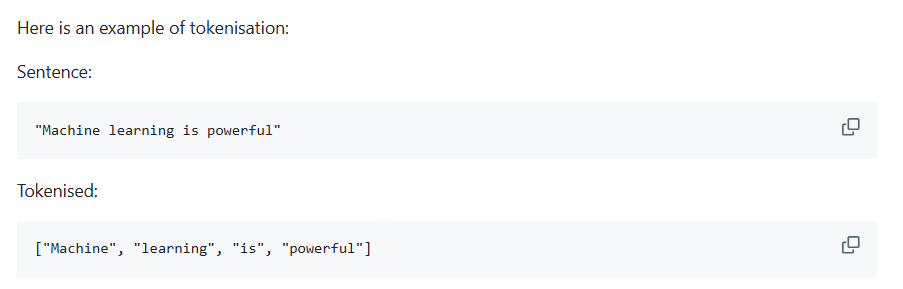
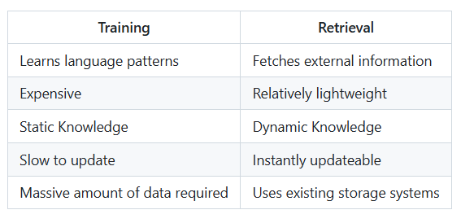
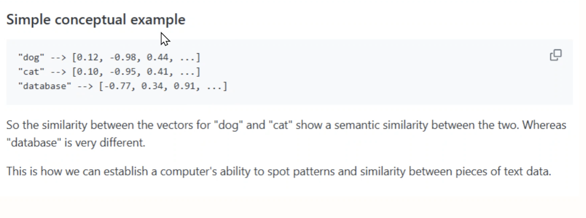

# LLMs & data engineering

## What are LLMs?

**LLM** stands for **Large Language Model**. It is a machine-learning model trained on a very large collection of examples of language and other data. During training, the model adjusts a very large number of internal values called **parameters** so that it becomes good at recognising patterns in the examples.

Examples of LLM-based systems include Claude, ChatGPT, Gemini, Grok, DeepSeek and Perplexity. These products may combine an LLM with other features such as web search, tools, file processing or a user interface, so the product and the underlying model are not always exactly the same thing.

### Are LLMs just a big database?

No. A database stores records that can usually be retrieved exactly. An LLM stores learned statistical patterns in its parameters. It does not normally keep a searchable copy of every sentence in its training data, and it cannot guarantee that a fact it produces is correct or current.

This distinction is useful:

- A database answers questions by looking up stored data.
- An LLM generates a new sequence of tokens based on patterns it learned.
- An LLM can be given retrieved data as context, allowing it to explain or summarise that data without being the database itself.

## What can be used to train an LLM?

Training data can include books, forums, web pages, documentation, public code repositories, metadata, videos and artificially generated data. The data should be collected and prepared carefully: low-quality, duplicated, private or copyrighted data can create legal, privacy and quality problems.

Training is expensive and happens before most users send prompts. Adding a new document to a company system does not automatically train the model on that document.

## What are LLMs trying to do?

At a base level, an LLM predicts the most likely next **token** in a sequence. It repeats this process token by token until it has produced a response or reached a stopping condition. To make these predictions, it identifies patterns in the input and in the relationships between words, code, concepts and other tokens.

The result can look like reasoning or understanding, but the core operation is still prediction. The model is predicting what sequence is likely to be a useful continuation of the conversation, based on its training and the current context.

## Prediction, not understanding

When we say an LLM predicts rather than understands, we mean that it does not have human experiences, intentions or guaranteed access to the meaning of the world. It calculates patterns that often correspond to meaning well enough to produce useful language.

This does not mean that an LLM is random or useless. A prediction can be highly accurate when the pattern is clear. It does mean that fluent wording is not proof of truth. The model can give a confident answer that is unsupported, out of date or completely invented.

### Examples of accurate predictions

Each request below asks the model to predict a likely continuation or outcome. The accuracy comes from strong patterns in the prompt or in the model's training data, not from the model personally observing the situation.

1. **Text completion:** “The opposite of hot is ___.” A model will usually predict “cold”.
2. **Arithmetic pattern:** “If one apple costs £2, three apples cost ___.” A model will usually predict “£6”. A calculator or code should still be used when exact results matter.
3. **Syntax:** “Complete this Python code: `for item in items:`” A likely continuation is an indented statement such as `print(item)`.
4. **Translation:** “Translate `Bonjour` into English.” A model will usually predict “Hello”.
5. **Classification:** “Classify this message as spam or not spam: ‘You have won a prize. Click now!’” A model will usually predict “spam”.
6. **Summarisation:** “Summarise this paragraph in one sentence.” Given a clear paragraph, the model can predict a concise summary that preserves its main point.
7. **Multiple-model check:** Ask ChatGPT and Claude the same general-knowledge question, such as “What is the capital of France?” Both will usually predict “Paris”, although agreement between models is not by itself proof that an answer is correct.

## Tokens and tokenisation

A **token** is a small unit that an LLM reads and generates. Depending on the tokeniser, a token may represent a whole word, part of a word, punctuation, whitespace, a number or a symbol. For example, the word `unbelievable` might be split into multiple tokens, while a short common word might be one token.

**Tokenisation** is the process of splitting text into tokens before the model processes it. The model works with token IDs rather than directly with ordinary characters and words. The exact split differs between models, so token counts are estimates unless measured with that model's tokeniser.



Tokens matter because they affect:

- **Cost:** many hosted APIs charge by input and output token count.
- **Processing:** more tokens require more computation.
- **Latency:** larger requests and responses can take longer.
- **Context limits:** a prompt and its response must fit within the model's maximum token capacity.

## Context windows

The **context window** is the maximum number of tokens an LLM can consider for one request, including the instructions, conversation history, attached text and usually the requested response. It is like the model's working area for that request, not a permanent memory.

If a conversation or document is too long, the application may truncate older content, summarise it, split it into sections or reject the request. A model with a larger context window can process more text at once, but that does not guarantee that every detail will receive equal attention.

Ways to work around context-window limits include:

- Remove irrelevant text and summarise earlier conversation.
- Split a large document into smaller chunks and process them separately.
- Retrieve only the most relevant chunks for each question.
- Store information outside the model in a database or document store.
- Use a vector database and semantic retrieval to find relevant content.
- Ask the model to create intermediate summaries, then use those summaries in a later request.

## Hallucinations

An **AI hallucination** is a response that sounds plausible but is false, unsupported or invented. Hallucinations happen because the model is optimising for a likely, helpful-sounding sequence of tokens rather than checking every claim against a live source of truth. They are more likely when the question is ambiguous, the topic is rare or recent, the prompt lacks relevant context, or the model is pushed to answer when it should say “I don't know”.

Reduce the risk by providing trusted source material, asking for citations or quotations, using retrieval, validating important outputs with a database or another tool, and allowing the model to state uncertainty. Retrieval helps, but it does not make an answer automatically correct: the retrieved data and the generated answer still need checking.

## Training vs retrieval

**Training** teaches a model general patterns. It is resource-intensive and changes the model's parameters. Once training is complete, the model's knowledge is relatively static until it is retrained or fine-tuned.

**Retrieval** fetches relevant information at runtime. The application finds data from an external source, adds that data to the prompt as context, and asks the LLM to generate a response using it. Retrieval can provide current or private information without retraining the whole model.

External data matters because a model may not have seen it during training, may not have access to the latest version, or may not be permitted to memorise private company information. Examples include internal documentation, company emails, SharePoint files, customer data and product data. Retrieval can make those sources available for a specific request while keeping the source system as the authority.

## What is RAG?

**RAG** stands for **Retrieval-Augmented Generation**. It is a system design in which retrieval augments the LLM's prompt before generation. The LLM is still responsible for producing the language; a separate retrieval step supplies relevant evidence.

### Basic RAG prompt-response flow

1. A user asks a question.
2. The application turns the question into a search query.
3. A retrieval system searches an approved collection of documents or records.
4. The most relevant results are selected and inserted into a prompt as context.
5. The LLM receives the user's question plus the retrieved context.
6. The LLM predicts and generates a response, ideally grounded in that context.
7. The application may show citations, apply safety checks, or validate the response before returning it.

For example, an employee asks, “What is our parental leave policy?” The application retrieves the relevant policy document, includes the matching section in the prompt, and asks the LLM to answer using that section. The LLM did not learn the company's policy merely by being asked; the policy was retrieved and supplied at request time.



## Bonus

### How do we represent text for computers to compare meaningfully?
- turn data into `embeddings`
- numerical representation of data
- vectors -> semantic meaning


These concepts explain how systems can represent and retrieve information by meaning rather than only by exact words. They are especially important when building semantic search and RAG systems.

### What is semantic similarity?

**Semantic similarity** is a measure of how close two pieces of content are in meaning. The words do not need to be identical.

For example:

- “How do I change my password?” and “I forgot my login credentials” are semantically related.
- “How do I change my password?” and “What is the weather today?” are not closely related.

Keyword search may miss the first pair because they use different words. Semantic search tries to recognise that both are about account access and passwords.

Semantic similarity is usually a score rather than a simple yes/no answer. A higher score means that two items are considered more similar according to the representation and comparison method being used.

### Why is semantic similarity not a normal traditional database query?

Traditional databases are excellent at queries with explicit rules, such as:

```sql
SELECT * FROM customers WHERE country = 'UK';
```

They can also search for exact words or patterns using indexes and text-search features. However, a traditional query does not automatically know that “automobile” and “car” have related meanings. It normally needs an explicit condition, synonym list or business rule telling it how to make that connection.

Semantic search adds a different kind of comparison: it represents content numerically and compares the position of those representations. Modern databases can support vector search, but the semantic understanding comes from the embedding model and vector comparison rather than from ordinary `WHERE` clauses alone.

### What are embeddings?

An **embedding** is a list of numbers that represents an item such as text, an image, audio or a product. An embedding model converts the item into this list so that useful relationships can be compared mathematically.

Text with similar meanings should ideally produce embeddings that are close together. For example, the sentences “The dog is sleeping” and “A puppy is taking a nap” should have more similar embeddings than “The database server is unavailable”.

An embedding is not a human-readable definition of the text. Each number usually does not have a simple meaning such as “this number represents dogs”. Meaning is distributed across the whole list of numbers.

### Why are embeddings important in AI systems?

Embeddings allow an AI system to compare content by meaning. They can be used for:

- Semantic search over documents.
- Finding similar support tickets or customer questions.
- Recommending related products, articles or code examples.
- Grouping or clustering documents by topic.
- Detecting duplicate or near-duplicate content.
- Retrieving relevant context for a RAG prompt.

The embedding model matters. Different models may produce different vector sizes and may be better at different languages, domains or types of content. Embeddings should be generated consistently: the same model and compatible settings should normally be used for the data being stored and for later search queries.

### What are vectors?

A **vector** is an ordered list of numbers. In an AI system, a vector can represent the features of an item in a form that software can compare.

Here are two simple example vectors:

```text
vector A = [0.20, 0.70, -0.10]
vector B = [0.25, 0.65, -0.05]
vector C = [-0.80, 0.10, 0.90]
```

In this example, A and B point in similar directions, so they may represent items with related meanings. C points in a very different direction. Real embedding vectors usually have hundreds or thousands of dimensions, so we cannot easily draw or interpret every dimension by hand.

### What is vector space?

**Vector space** is the mathematical space in which vectors exist. Each number is a coordinate along one dimension. A three-number vector can be imagined as a point in three-dimensional space; a real embedding may be a point in hundreds of dimensions.

The embedding model places related items near one another in this space. A collection of documents might therefore form groups for topics such as payments, authentication and delivery. This is not a perfect map of meaning, but it gives a search system a useful way to find nearby content.

The dimensions are not necessarily labels that humans can name. We usually care more about the relative distances or directions between vectors than about the value of any single coordinate.

### What is cosine similarity?

**Cosine similarity** compares two vectors by measuring the angle between them. It focuses on direction rather than the absolute size of the vectors.

```text
cosine similarity(A, B) = (A dot B) / (length of A * length of B)
```

The result is commonly interpreted like this:

- A score near `1` means the vectors point in very similar directions.
- A score near `0` means they are largely unrelated or at right angles.
- A negative score means they point in opposite directions, although the exact interpretation depends on the embedding model.

For the example vectors above, A and B would have a high cosine similarity, while A and C would have a much lower similarity. A search system can compare the vector for a user's question with document vectors and return the documents with the highest scores.

### How do these ideas fit together?

The typical semantic-search process is:

1. Split documents into useful chunks.
2. Use an embedding model to convert each chunk into a vector.
3. Store the chunks, vectors and useful metadata in a vector database.
4. Convert a user's question into a query vector using the same embedding model.
5. Compare the query vector with stored vectors using cosine similarity or another distance measure.
6. Return the most similar chunks to the application or an LLM.

This is why vector databases are useful for RAG: they make it practical to retrieve documents that are semantically related to a question, even when the question and the documents use different wording. The quality of the final answer still depends on chunk size, metadata, the embedding model, the similarity measure and the quality of the retrieved results.

### What trade-offs do these design choices introduce?

There is no single perfect configuration for semantic search. Each choice affects how much relevant information is found, how much irrelevant information is returned, and how much the system costs to run.

#### Chunk size

Documents are usually split into smaller sections, called **chunks**, before they are embedded and stored.

- **Smaller chunks** are more precise and contain less irrelevant information. However, they may lose important context, such as the heading or explanation that gives a sentence its meaning.
- **Larger chunks** preserve more context and may be easier for an LLM to understand. However, they may match a query less precisely, use more tokens, and return unrelated information alongside the useful passage.
- **Overlapping chunks** repeat a small amount of text between neighbouring chunks. This helps avoid cutting an important idea in half, but increases storage and processing costs.

The best chunk size depends on the content. A legal policy, a code file and a product catalogue may need different chunking strategies.

#### Metadata

**Metadata** is information stored alongside a document chunk, such as its title, author, date, department, product category or access permissions.

Metadata can improve retrieval by allowing filters such as “search only documents from the finance department” or “use the latest policy version”. It can also help an LLM cite the source of an answer.

However, metadata must be accurate and consistently recorded. Incorrect metadata can hide the right document or return inappropriate results. Adding and maintaining many metadata fields also increases the complexity of the data pipeline.

#### Similarity measures

Different similarity or distance measures compare vectors in different ways. **Cosine similarity** compares their direction, while measures such as Euclidean distance compare their position and absolute distance.

The measure should match the embedding model and the way its vectors are intended to be used. A poor choice can rank relevant documents too low or make unrelated documents appear similar. Similarity scores are also not universal: a score from one embedding model should not automatically be compared with a score from another model.

#### Retrieval quality

Retrieval quality describes whether the system finds the right information for the user's question.

- **Low recall** means the relevant document was not retrieved at all.
- **Low precision** means too many irrelevant documents were retrieved.
- Returning too few chunks may omit important evidence.
- Returning too many chunks may overwhelm the context window and distract the LLM.

Retrieval quality is affected by the chunking method, embedding model, metadata, search settings and the number of results returned. It should be tested with realistic questions and known correct documents, rather than judged only by whether the final answer sounds fluent.

#### The main trade-off

In practice, a RAG system is balancing **relevance, context, speed, cost and reliability**. A useful system retrieves enough focused evidence for the LLM to answer accurately, while avoiding so much text that the important information is diluted or the context window is exceeded.