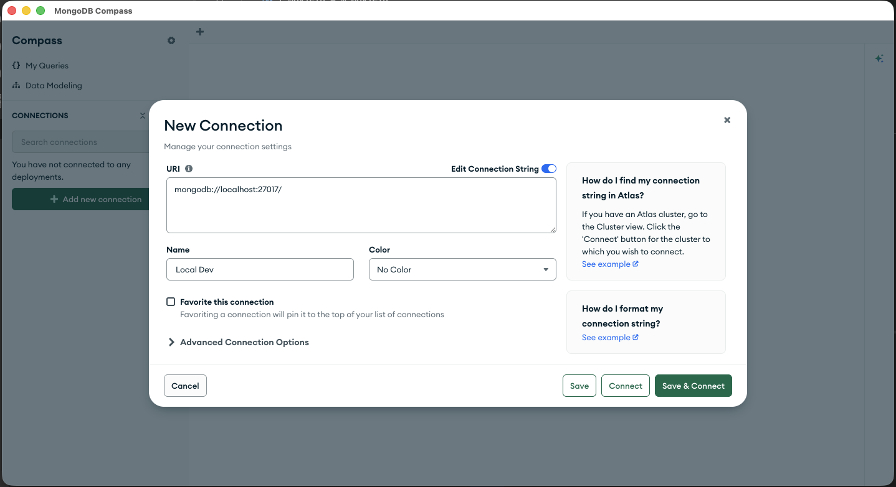
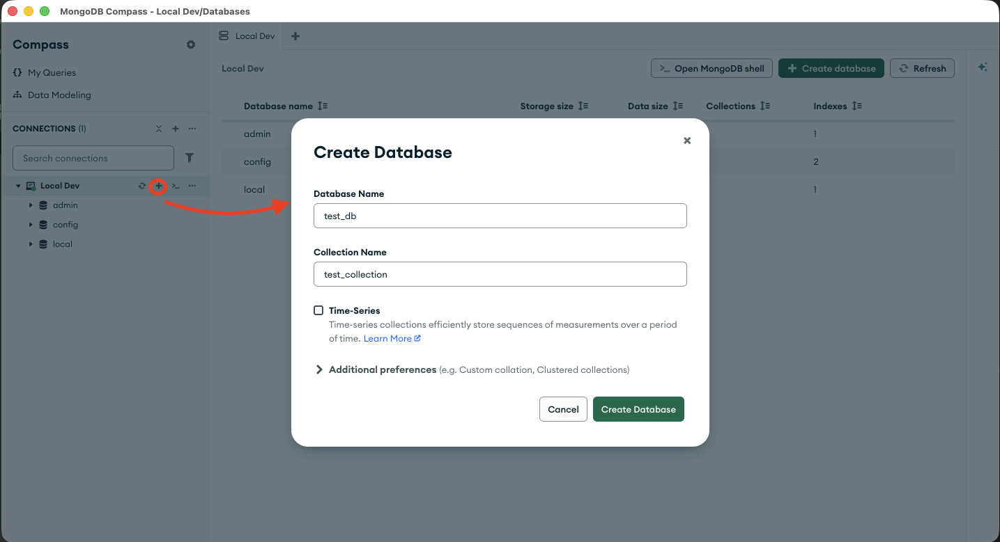
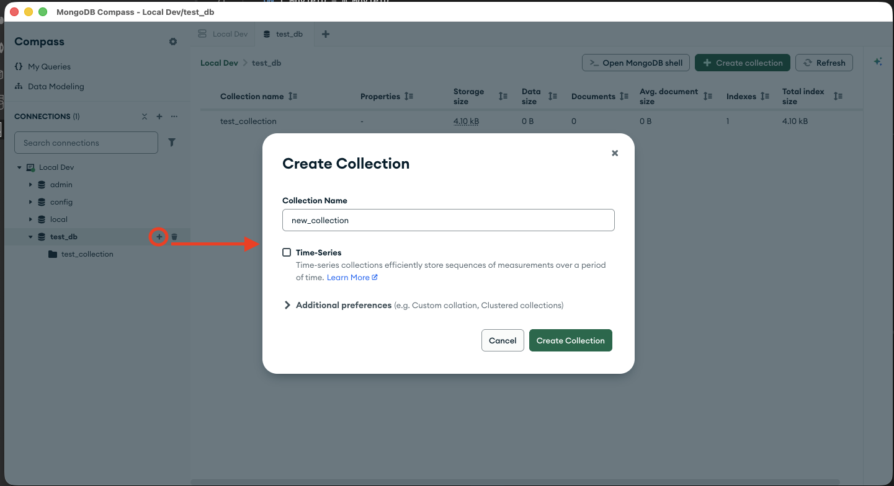
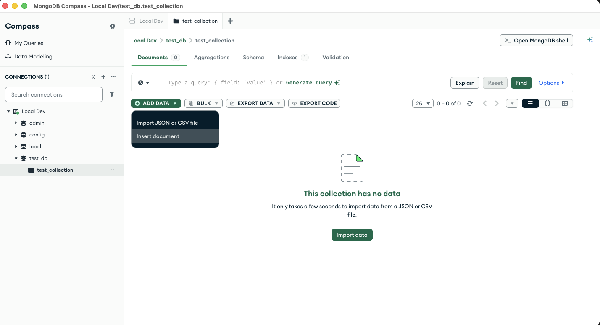
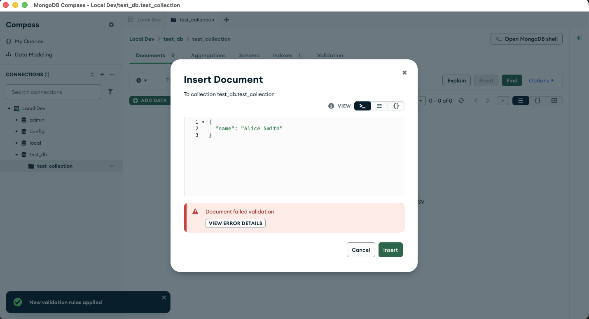
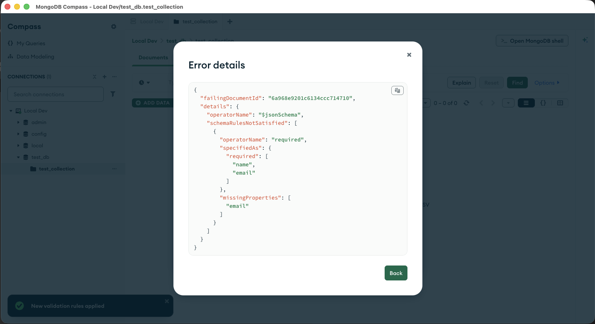

# Introduction to MongoDB

## What is MongoDB?

- **NoSQL Database**: A non-relational database that stores data in flexible, JSON-like documents
- **Document-Oriented**: Data is organized in collections of documents rather than rigid tables
- **Flexible Schema**: Documents in the same collection can have different structures and fields
  - *Example*: A "users" collection could have some documents with a "phone" field and others without it
  - *Example*: One user document might have `{name, email, age}` while another has `{name, email, company}`
  - This differs from SQL tables where every row must have all the same columns
- **Scalability**: Designed for horizontal scaling across distributed systems
  - *How it works*: MongoDB uses **sharding** to split data across multiple servers
  - *Benefit*: Instead of buying one massive server, you add more servers to handle more data and traffic
  - *Example*: A popular app can split user data across 3 servers (Server A handles users A-H, Server B handles I-Q, etc.)
- **High Performance**: Optimized for fast read and write operations on large datasets
- **Query Language**: Uses MongoDB Query Language (MQL) for intuitive data retrieval
- **Use Cases**: Ideal for real-time applications, content management, IoT data, and analytics

## Pros and Cons

### Pros
- **Flexible Schema**: You don't need to plan your data structure perfectly upfront; you can add new fields anytime without rewriting everything
- **Developer-Friendly**: Data looks like JSON (similar to JavaScript objects), which feels natural if you know web development
- **Fast Development**: Start building right away without spending time setting up complicated table structures
- **Scalable**: When your app grows and needs to store more data, you can easily add more computers to handle it
- **Built-in Backup**: MongoDB automatically makes copies of your data so you don't lose it if something breaks
- **Keep Related Data Together**: You can store information about a single object (like a user and their address) in one place instead of splitting it across multiple tables

### Cons
- **Uses More Computer Memory**: MongoDB stores data in a format that takes up more RAM than traditional databases
- **Data Can Become Messy**: Without strict rules, you might end up with similar data stored in different ways, making it confusing to work with
- **Writing Complex Requests**: Some data questions that are quick to ask a SQL database require longer, more complicated code in MongoDB
- **Safety Concerns**: If you update multiple pieces of data at once, MongoDB doesn't guarantee they all succeed or all fail together (this has improved in newer versions)
- **Takes Up More Space**: Because of how MongoDB stores data, it uses more disk storage compared to traditional databases
- **Different Way of Thinking**: If you know SQL already, MongoDB works differently and requires learning new concepts


## Common use cases

- **Mobile Apps**: Apps that need to work offline and sync data when reconnected
- **Real-Time Analytics**: Dashboards and reports that need to update instantly as new data comes in
- **Content Management Systems (CMS)**: Blogs, news sites, and media platforms that store articles with varying fields
- **E-Commerce**: Product catalogs where items have different attributes (shoes have shoe size, books have page count, etc.)
- **Social Media**: User profiles, posts, comments, and feeds with constantly changing structure
- **Internet of Things (IoT)**: Storing sensor data from thousands of devices that might report different types of measurements
- **User Profiles & Personalization**: Storing user preferences, settings, and activity history that changes frequently
- **Chat & Messaging**: Real-time messaging applications that need fast writes and reads
- **Game Development**: Storing player data, game states, and inventory items with flexible properties
- **Log & Event Tracking**: Recording application logs and user events for analysis and debugging

## Comparison to SQL
- **SQL Table** = MongoDB Collection
- **SQL Row** = MongoDB Document
- **SQL Column** = MongoDB Field

## Connecting to MongoDB locally, using Compass

### Step 1: Install MongoDB Community Edition
- Download and install MongoDB from [mongodb.com](https://www.mongodb.com/try/download/community)
- Follow the installation instructions for your operating system (Windows, Mac, or Linux)
- MongoDB will run as a service in the background after installation

### Step 2: Install MongoDB Compass
- Download MongoDB Compass (the GUI tool) from [mongodb.com/products/compass](https://www.mongodb.com/products/compass)
- Install it on your computer following the installation wizard
- Compass is a visual tool that makes it easy to explore and manage your MongoDB data

### Step 3: Open MongoDB Compass
- Launch the Compass application
- You should see a connection screen ready to connect to a local MongoDB instance

### Step 4: Create a New Connection
- Click on the **New Connection** button (or **+** icon if you already have a connection)
- You can either use the **Connection String** tab to enter a connection URI, or use the **Advanced** tab for more detailed settings
    - For a local MongoDB, the default connection string is already filled: `mongodb://localhost:27017`

- You can give your connection a friendly name (like "Local Dev") to save it for future use
- Click **Save Connection** to save this connection profile



### Step 5: Connect to Local MongoDB
- Select your connection from the list (or use the default if you just created it)
- Click the **Connect** button
- If MongoDB is running, you'll see a list of databases on the left side of the screen

### Step 6: Explore Your Data
- Click on a database name to see its collections
- Click on a collection to view the documents (individual records) it contains
- You can view, edit, add, and delete documents using Compass's intuitive interface

### Tips
- Make sure MongoDB service is running before trying to connect with Compass
- On Mac/Linux, you can start MongoDB with: `brew services start mongodb-community`
- The connection defaults to your local machine, so you don't need a password for local development

## Creating a new database

### Step 1: Connect to MongoDB
- Make sure you're already connected to your MongoDB instance in Compass (see the "Connecting to MongoDB locally, using Compass" section above)

### Step 2: Create a New Database
- In the left sidebar of Compass, look for a **+ Create Database** button or right-click in the empty space
- Click the **+ Create Database** button
- A dialog box will appear asking you to enter a database name

### Step 3: Name Your Database
- Enter a meaningful name for your database (e.g., "studentapp", "ecommerce", "my_first_db")
- Database names should be lowercase and can include numbers and underscores
- Avoid spaces and special characters in database names
- Click the **Create** button

### Step 4: Create Your First Collection
- A collection is like a table in SQL — it holds a group of related documents
- MongoDB won't create an empty database, so you need to create at least one collection
- You'll see a prompt asking for a collection name (e.g., "users", "products", "posts")
- Enter a collection name and click **Create Collection**

### Step 5: Your Database is Ready!
- Your new database now appears in the left sidebar under the list of databases
- You can expand it to see your collections
- You're now ready to start adding documents (data) to your collections

### Example
Let's say you're building a student management app:
1. Create a database called `student_app`
2. Create collections like:
   - `students` (for student information)
   - `courses` (for course details)
   - `grades` (for student grades)

Each collection will store documents related to that topic.



## Creating a new collection

### What is a Collection?
A **collection** is a group of related documents stored together in a database. Think of it like a table in a SQL database, but more flexible:
- **Like a Container**: A collection holds multiple documents (records) of similar data
- **Example**: A `users` collection stores all your user documents (each user is one document)
- **Flexible Structure**: Documents in a collection can have different fields — one user might have a "phone" field while another doesn't
- **No Schema Required**: Unlike SQL tables, you don't need to define what fields each document must have before adding data


### Steps to Create a New Collection

### Step 1: Open Your Database
- In Compass, click on your database name in the left sidebar to expand it
- You should see any existing collections listed under the database

### Step 2: Create a New Collection
- Click the **+ Create Collection** button next to your database name
- Alternatively, right-click on your database name and select "Create Collection"

### Step 3: Name Your Collection
- Enter a meaningful collection name (e.g., "users", "products", "posts", "comments")
- Collection names should be lowercase and descriptive
- Avoid spaces; use underscores instead (e.g., "user_profiles" instead of "user profiles")
- Click the **Create** button

### Step 4: Your Collection is Ready
- Your new collection appears in the list under your database name
- The collection is now empty and ready to receive documents
- You can start adding documents to this collection

### Common Collection Names Examples
- **`users`** - for storing user accounts and profiles
- **`products`** - for storing product information
- **`orders`** - for storing customer orders
- **`blog_posts`** - for storing blog articles
- **`comments`** - for storing user comments
- **`reviews`** - for storing product reviews




## Adding a document and adding multiple documents

### What is a Document?
A **document** is a single record of data in MongoDB, similar to a row in a SQL table. Here's what makes documents special:
- **JSON Format**: Documents are stored as JSON objects with key-value pairs (like `{name: "John", age: 25}`)
- **Unique ID**: MongoDB automatically assigns each document a unique `_id` field to identify it
- **Flexible Fields**: Each document can have different fields — you don't have to store the same information for every record
- **Example**: In a `users` collection, one document might be `{name: "Alice", email: "alice@email.com"}` while another is `{name: "Bob", email: "bob@email.com", phone: "555-1234"}`

### Adding a Single Document

#### Step 1: Open Your Collection
- In Compass, navigate to your database in the left sidebar
- Click on the collection where you want to add a document

#### Step 2: Click Insert Document
- In the collection view, click the **+ Add Data** button at the top and select **Insert document**
- A document editor will open with an empty template

#### Step 3: Write Your Document
- Enter your data in JSON format
- Example:
  ```json
  {
    "name": "John Doe",
    "email": "john@example.com",
    "age": 28,
    "city": "New York"
  }
  ```
- MongoDB will automatically add an `_id` field if you don't provide one

#### Step 4: Save the Document
- Click the **Insert** button to save your document
- Your document is now stored in the collection and appears in the list

### Adding Multiple Documents

#### Step 1: Prepare Your Data
- You can add multiple documents one at a time using the same steps above, OR
- Use Compass's import feature if you have data in JSON or CSV format

#### Step 2: Method B - Import Multiple Documents
- Click the **+ Add Data** button and look for an **Import** option
- Select your file (JSON or CSV format)
- Compass will preview the documents before importing
- Click **Import** to add all documents at once
- This is faster for adding large amounts of data

#### Step 4: Verify Your Documents
- After adding documents, they appear in the collection view
- You can scroll through the list to see all your documents
- Click on any document to view or edit its details

### Tips
- **Field Names**: Use descriptive field names (e.g., `firstName` instead of `fn`)
- **Data Types**: You can use strings, numbers, booleans, dates, and even nested objects
- **Auto-ID**: Let MongoDB create the `_id` field automatically; you don't need to provide it
- **Validation**: Check that your JSON format is correct before inserting — Compass will show errors if there are issues



## Core Concepts

### 1. Validation

**Validation** is a set of rules that MongoDB enforces when you insert or update documents in a collection. It helps ensure that your data is consistent and correct, even though MongoDB has a flexible schema.

#### Why Use Validation?
- **Data Quality**: Ensures documents have required fields and correct data types
- **Consistency**: Prevents invalid data from being added to your collection
- **Error Prevention**: Catches mistakes early before bad data gets stored
- **Business Rules**: Enforces specific requirements for your application

#### How Validation Works
- You define a schema with rules for each field (required, data type, constraints)
- When you try to insert or update a document, MongoDB checks it against these rules
- If the document doesn't meet the requirements, MongoDB rejects it and shows an error message
- Only valid documents are allowed into the collection

#### Example Validation Rules
- **Required Fields**: A user must have a `name` and `email`
- **Data Types**: `age` must be a number, not a string
- **String Length**: `email` must be at least 5 characters long
- **Number Range**: `age` must be between 0 and 150
- **Enum Values**: `status` can only be "active", "inactive", or "pending"

#### Setting Up Validation in MongoDB Compass

**Step 1: Open Your Collection**
- Navigate to your collection in Compass
- Click on the **Validation** tab at the top

**Step 2: Enter Validation Rules**
- Click **Add Validation Rule** or **Edit JSON Schema**
- Write your validation rules in JSON format
- Example validation schema:
  ```json
  {
    $jsonSchema: {
      bsonType: "object",
      required: ["name", "email"],
      properties: {
        name: {
          bsonType: "string",
          description: "Student name (required, string)"
        },
        email: {
          bsonType: "string",
          pattern: "^[a-zA-Z0-9._%+-]+@[a-zA-Z0-9.-]+\\.[a-zA-Z]{2,}$",
          description: "Valid email address (required, string)"
        },
        age: {
          bsonType: "int",
          minimum: 0,
          maximum: 150,
          description: "Student age (optional, must be 0-150)"
        },
        studentId: {
          bsonType: "string",
          description: "Unique student ID (required, string)"
        }
      }
    }
  }
  ```

**Step 3: Save Validation Rules**
- Click **Update** or **Save** to apply the validation
- All new documents must now follow these rules

#### Testing Validation: Invalid Entry
When you try to insert a document that doesn't meet the validation rules, MongoDB rejects it.

**Invalid Example - Missing Required Fields:**
```json
{
  "name": "Alice Smith"
}
```

**Output/Error:**




#### Testing Validation: Valid Entry
When you insert a document that meets all validation rules, MongoDB accepts it.

**Valid Example:**
```json
{
  "name": "Carol Williams",
  "email": "carol@example.com",
  "age": 22,
  "studentId": "S001"
}
```

**Output/Success:**
```
Document inserted successfully with ID: ObjectId("...")
```

**Another Valid Example (age is optional):**
```json
{
  "name": "David Brown",
  "email": "david@example.com",
  "studentId": "S002"
}
```

**Output/Success:**
```
Document inserted successfully with ID: ObjectId("...")
```

#### Key Takeaways
- **Validation prevents bad data**: Documents that don't match your rules are rejected
- **Clear error messages**: MongoDB tells you exactly what's wrong
- **Flexible fields**: Fields marked as optional (not in "required") can be omitted
- **Validation can be updated**: You can modify rules anytime, but existing documents aren't checked until they're updated