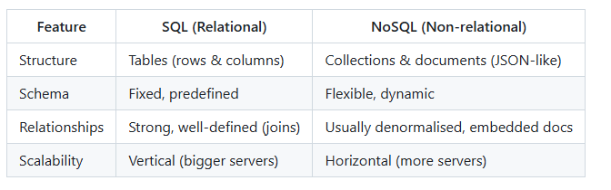

NoSQL databases:
- Key/values DB - eg. Redis
- Document DB - eg. MongoDB
- Wide column DB 
    - organize into column families rather than relational rows
    - good for large data
    - eg. Apache Cassandra
- Graph DB
    - create nodes and relationships between nodes
    - good for social networks, recommendation engines
    eg. neo4u?

    