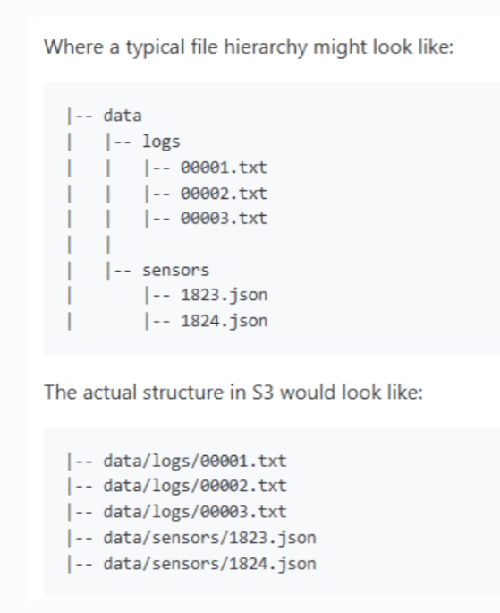

# Amazon S3 Review Notes

## What is S3?

Amazon S3, or **Simple Storage Service**, is AWS cloud object storage. It stores data as objects inside buckets.

An object can be almost any type of file, including images, JSON, videos, backups, and application data.

S3 is not a traditional file system or a relational database. It is designed to store and retrieve complete objects, rather than update individual rows or files in place. Applications usually access objects through the AWS console, the AWS CLI, or an AWS SDK such as `boto3` for Python.

## Core Concepts

- **Bucket:** A container for objects. Buckets can store many different types of data.
- **Object:** The stored data, together with its metadata.
- **Key:** The object's name or identifier within a bucket.

A useful mental model is a bucket as a large storage container, an object as an item in that container, and a key as the label used to find the item. A bucket can contain objects with different file types and purposes.

For example, in `my-bucket/data/users.json`:

- `my-bucket` is the bucket.
- `data/users.json` is the key.
- The contents of `users.json` are the object data.

## How S3 Organises Data

S3 uses a mostly flat structure rather than real folders. A key such as `data/users.json` contains `/` characters, so the AWS console displays it as if it were inside a `data` folder. The folder structure is created by the key name.



Objects are private by default. Access must be granted through appropriate AWS permissions or other sharing settings.

Access is commonly controlled with AWS Identity and Access Management (IAM). A user or application needs permission to perform actions such as listing a bucket, uploading an object, or downloading an object. Knowing the bucket name and key is not enough by itself.

Buckets are created in a chosen AWS **Region**, such as `eu-west-2` (London). The region affects latency, availability, compliance, and pricing. The region is usually configured in the AWS profile or selected when creating a client with an SDK.

S3 offers different **storage classes**, which are designed for different access patterns and cost requirements: [AWS S3 storage classes](https://aws.amazon.com/s3/storage-classes/).

## Why Use S3?

- **Scalability:** Store very large amounts of data without managing physical storage.
- **Durability:** S3 is designed to protect data against loss.
- **Cost flexibility:** Costs depend mainly on storage used, requests, and data accessed or transferred.
- **Integration:** S3 connects easily with many AWS services.

## Basic S3 Workflow

1. Create or choose a bucket in an AWS Region.
2. Give the relevant user or application the minimum required permissions.
3. Upload an object using a key, for example `data/users.json`.
4. Retrieve, process, or share the object when needed.
5. Delete or move old data according to the application's retention needs.

Common S3 actions are:

- **List:** View buckets or the objects in a bucket.
- **Put:** Upload an object.
- **Get:** Download or read an object.
- **Delete:** Remove an object.

For Python, `boto3` can use a configured AWS profile to create an S3 client:

```python
import boto3

session = boto3.Session(profile_name="student")
s3 = session.client("s3")
s3.upload_file("data.json", "my-bucket", "data/data.json")
```

The profile supplies credentials and can also supply the default region. Keep credentials in AWS configuration files or environment variables rather than in source code.

## CRUD Operations with `boto3`

CRUD stands for **Create, Read, Update, and Delete**. In S3, these operations work with objects identified by a bucket name and key.

```python
import boto3

session = boto3.Session(profile_name="se-data-eng")
s3 = session.client("s3")

bucket = "data-eng-resources"
key = "se-sept-26/test/dinesh.json"
```

### Create: Upload an Object

Use `upload_file` to upload a local file. The file is stored under the key provided.

```python
s3.upload_file(
	Filename="data.json",
	Bucket=bucket,
	Key=key
)
```

You can also create an object directly from a string or bytes with `put_object`:

```python
s3.put_object(
	Bucket=bucket,
	Key="data/message.txt",
	Body="Hello from S3"
)
```

### Read: Retrieve an Object

Use `get_object` to read an object's contents. The response body is a stream, so call `.read()` before processing it.

```python
response = s3.get_object(Bucket=bucket, Key=key)
contents = response["Body"].read()
print(contents.decode("utf-8"))
```

For a local copy, use `download_file`:

```python
s3.download_file(bucket, key, "downloaded-data.json")
```

### Update: Replace an Object

S3 does not edit part of an object in place. Uploading new data with the same bucket and key replaces the existing object.

```python
s3.upload_file(
	Filename="updated-data.json",
	Bucket=bucket,
	Key=key
)
```

If versioning is enabled on the bucket, the previous version can be retained. Without versioning, the replacement may remove access to the previous contents.

### Delete: Remove an Object

Use `delete_object` to remove an object:

```python
s3.delete_object(Bucket=bucket, Key=key)
```

Deleting an object requires the appropriate IAM permission, usually `s3:DeleteObject`. The same principle applies to the other operations: the application's IAM policy should grant only the actions it needs.

## Important Cost Rule

Data uploaded to S3 is generally called **ingress** and is free. Data downloaded or transferred out is called **egress** and may incur charges. Always check the pricing for the region, service, and transfer route being used.

## Key Points to Remember

- A bucket holds objects; an object is identified by its key.
- S3 appears to have folders, but folders are represented by key names.
- Objects are private by default and require permission to access.
- Choose a region and storage class that match the application's needs.
- Uploading is generally free, but downloading and transferring data out may cost money.
