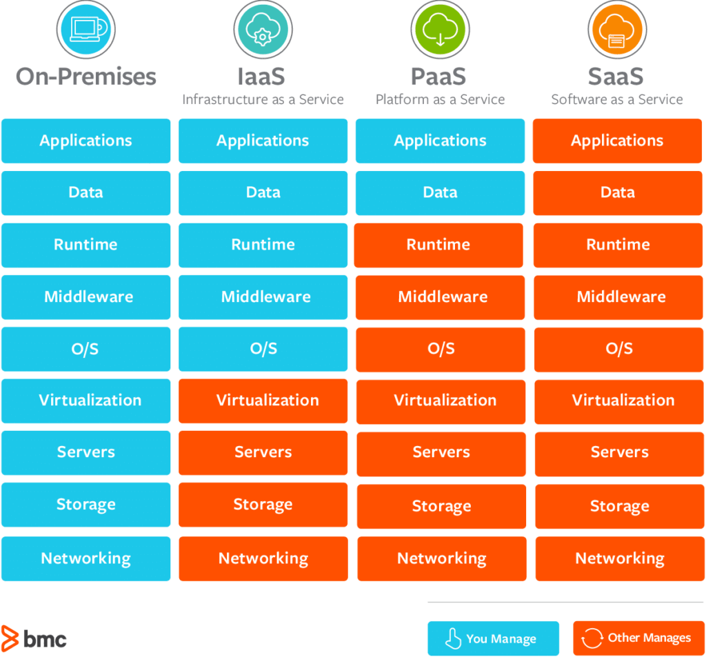
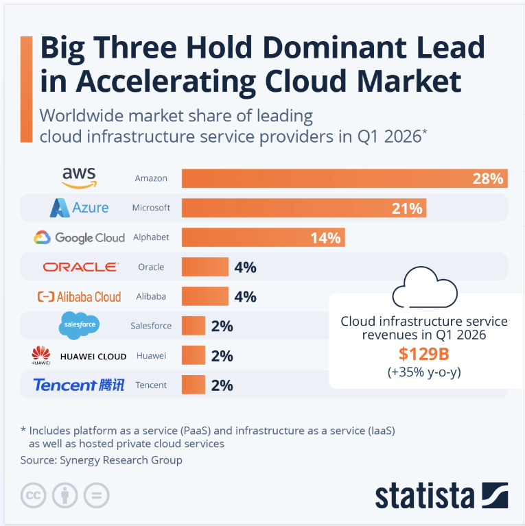

# Cloud computing intro
- computing resources delivered over the internet, on demand

## Cloud deployment models
- physical infrastructure

Simple model
1. Public cloud
- Shared Tenancy: sharing same hardware as other people

2. Private cloud
- Sole Tenancy: hardware reserved for an company
- eg. AWS sovereign datacenter in Germany

Complex model
3. Hybrid cloud
- as much as you can in public cloud and put the required bits in private cloud

4. Multi cloud
- Mix and match public cloud services
- for eg banks to ensure uptimes

## Cloud Service types
- what service you are getting

### IaaS
- Infrastructure as Service
- rent hardware + networking
- rest is on user to setup/maintain
- AWS EC2

### PaaS
- Platform as Service
- environment is provided
- you bring code and the data
- Databricks, snowflake, Pyspark

### SaaS
- Software as Service
- complete product that is run and maintained by service provider
- Streaming : Netflix, Youtube, Emails
- Cloud storage: Google Drive, iCloud, Dropbox
- Office 365
- Adobe creative cloud
- github
- Cloud gaming

### FaaS
- Functions as a Service
- fits into PaaS
- AWS Lambda
- trigger at certain times, don't care about hardware(you decide the hardware), ensure it runs

## Pros and Cons of using cloud services

### Pros
- scalability
- cost efficiency
- updates + maintenance
- security(shared responsibility)(physical/networking)
- Economies of scale
- Reliability - multiple servers, downtime in one region doesn't impact other regions
- mobility/accessibility
- go global fast
- promotes innovation

### Cons
- insane cost if not managed properly
- dependent on internet accessibility
- less control on security
- vendor locking
- compliance issues from global use
- skills/knowledge required
- service outages

## Market share

- AWS: first providers, safe bet, certified professionals, documentation
- Azure: devops quite good, Selling point: active directory(visibility/accesssibility through permissions)
- Google Cloud: good at data(bitquery), SREs, committed to opensource and flexibility => goto for multi-cloud

