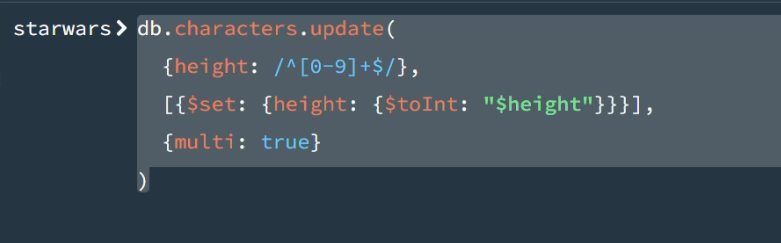
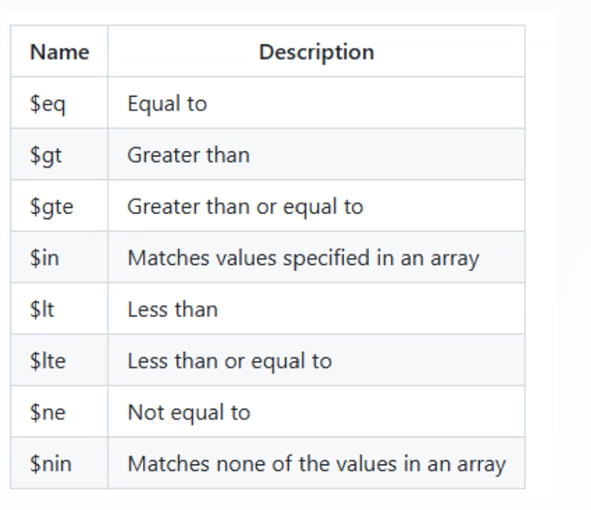
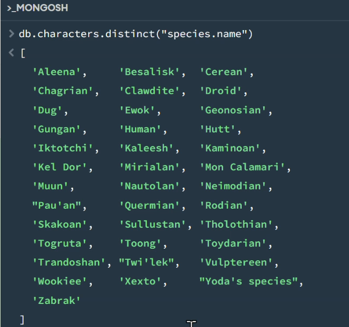

- cls: Clear screen
- db.createCollection(): Create a collection within database
- db.<collection>.insertOne({})
- db.<collection>.insertMany([{},{}])
- db.getCollectionInfos({name:"academy"})
- db.<collection>.find({}) -> SELECT *
- db.<collection>.updateOne({},{$set:{}})
eg. 
```json
db.students.updateOne(
  {name: "Mr S. Global"},
  {$set:{score: 92.5, newfield_example: true}}
)
```
```json
db.students.updateOne(
  {name: "Mr S. Global"},
  {$unset:{newfield_example: null}}
)
```
- db.<collection>.updateMany({})
```json
db.academy.updateMany(
  {},
  {$set: {length: 12}}
)
```
- db.<collection>.deleteOne({})
```json
db.students.deleteOne({year: 2020})
```
- db.deleteMany({})

## Query examples on Starwars DB

- Characters with yellow or orange eyes:
```json 
db.characters.find(
  {eye_color: {$in: ["yellow", "orange"]}},
  {name: 1, eye_color: 1, _id: 0}
)
```

- Characters with blue eyes and female
```json
db.characters.find(
  {$and: [{eye_color: "blue"}, {gender: "female"}]},
  {name: 1, eye_color: 1, gender: true, _id:0}
)
```

- Convert heights to int
```json
db.characters.updateMany(
  {},
  [
    {
      $set: {
        height: { $toInt: "$height" }
      }
    }
  ]
)
```

Or in aggregation pipeline to find characters with height > 170:
```json
db.characters.aggregate([
  {
    $project: {
      name: 1,
      height: { $toInt: "$height" }
    }
  },
  {
    $match: { height: { $gt: 170 } }
  }
])
```
- Find a way to convert the heights in the characters collection to integers.
    - When successful, find the average height per gender.
```json
db.characters.updateMany(
  {},
  [{
    $set: {
      height: {
        $cond: [
          {$eq: ["$height", "unknown"]},
          "unknown",
          { $toInt: "$height" }
        ]
      }
    }
  }]
)
```
Same using regex



```json
db.characters.aggregate([
  { $match: { 
    height: { $ne: "unknown" },
    gender: "male"
  } },
  { $group: {
    _id: null,
    avgHeight: { $avg: "$height" } }
  }
])
```

```json
db.characters.aggregate([
    {$match: {"species.name": "Human"}},
    {$group:{_id: null, total: {$sum: "$height"}}}
])

db.characters.aggregate([
    {$match: {"species.name": "Human"}},
    {$group:{_id: "$gender", total: {$sum: "$height"}}}
])

db.characters.aggregate([
    {$group: {_id:"homeworld.name", max: {$max: "$height"}}}
])

```

- Do the same for mass, but take into account the below.
    -What will you decide to do with the "unknown" heights?
    - Is "unknown" the same as a missing value?
    - Is it worth keeping "unknown" somehow --> takes more work

## Some operators



## Embedding vs referencing

- Less data redundancy in referencing
- Embedding is flexible and easy to use; less power needed to search(does not need to search for and resolve referenced documents)
So tradeoff between data redundancy and faster search

## Single-purpose aggregation



```json
db.characters.countDocuments({})

db.characters.estimatedDocumentCount({}) // more efficient; uses metatdata to estimate

```

## Referencing

### Example: Authors and Books with Referencing

**Authors collection:**
```json
db.authors.insertOne({
  _id: ObjectId("..."),
  name: "J.K. Rowling",
  country: "UK"
})
```

**Books collection (stores reference to author):**
```json
db.books.insertOne({
  _id: ObjectId("..."),
  title: "Harry Potter",
  author_id: ObjectId("..."),  // Reference to author
  year: 1997
})
```

### Using `$lookup` to Join Referenced Data
```javascript
db.books.aggregate([
  {
    $lookup: {
      from: "authors",           // Join with authors collection
      localField: "author_id",   // Field in books
      foreignField: "_id",       // Field in authors
      as: "author"               // Output array name
    }
  },
  {
    $project: {
      title: 1,
      year: 1,
      author: { $arrayElemAt: ["$author", 0] }  // Get first element
    }
  }
])
```

### Result
```json
{
  _id: ObjectId("..."),
  title: "Harry Potter",
  year: 1997,
  author: {
    _id: ObjectId("..."),
    name: "J.K. Rowling",
    country: "UK"
  }
}
```

**Key Advantage**: Less data redundancy - author info stored once, referenced many times
